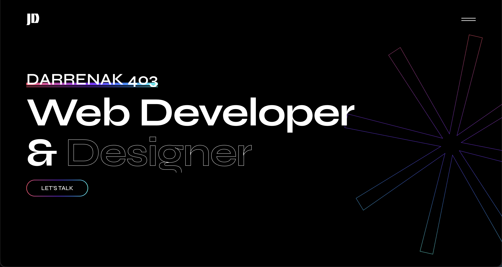

# 🎨 DarrenAK403 Portfolio

> A modern, animated portfolio website built with React, Vite, Tailwind CSS, and GSAP.



## ✨ Features

- ⚡ **Lightning Fast** - Built with Vite for instant HMR and optimized builds
- 🎭 **Smooth Animations** - GSAP with ScrollTrigger and SplitText for engaging scroll-driven effects
- 🎨 **Modern Design** - Tailwind CSS 4 with utility-first responsive styling
- 🔄 **React Router** - Client-side routing for seamless navigation
- 🐳 **Docker Support** - Containerized deployment with Docker Compose
- 📱 **Fully Responsive** - Mobile-first design approach
- 🔍 **SEO Optimized** - Open Graph and Twitter Card meta tags

## 🛠️ Tech Stack

- **Framework**: React 19.1
- **Build Tool**: Vite 7.1
- **Styling**: Tailwind CSS 4.1
- **Animation**: GSAP 3.13 (ScrollTrigger, SplitText)
- **Routing**: React Router DOM 7.9
- **Icons**: Iconify React
- **Fonts**: Fontsource (Inter, Syne)
- **Containerization**: Docker

## 🚀 Quick Start

### Prerequisites

- Node.js 18+ (LTS recommended)
- npm or yarn
- Docker (optional, for containerized deployment)

### Installation

1. **Clone the repository**

   ```bash
   git clone https://github.com/darrenak403/gsap-pratice.git
   cd gsap-pratice
   ```

2. **Install dependencies**

   ```bash
   npm install
   ```

3. **Start development server**

   ```bash
   npm run dev
   ```

4. **Open your browser**
   ```
   http://localhost:5173
   ```

### Docker Deployment

```bash
# Build and run with Docker Compose
docker-compose up -d

# Stop containers
docker-compose down
```

## 📜 Available Scripts

| Command           | Description                              |
| ----------------- | ---------------------------------------- |
| `npm run dev`     | Start development server with hot reload |
| `npm run build`   | Build production bundle                  |
| `npm run preview` | Preview production build locally         |
| `npm run lint`    | Run ESLint to check code quality         |

## 📁 Project Structure

```
gsap-pratice/
├── public/                 # Static assets
│   ├── favicon.svg        # Browser favicon
│   ├── banner.jpg         # OG image for social sharing
│   ├── robots.txt         # SEO robots file
│   └── sitemap.xml        # SEO sitemap
├── src/
│   ├── assets/
│   │   └── images/        # Image assets
│   ├── components/        # Reusable UI components
│   │   ├── CTA.jsx
│   │   ├── Footer.jsx
│   │   ├── GradientButton.jsx
│   │   ├── Navbar.jsx
│   │   └── ProjectData.jsx
│   ├── sections/          # Page sections
│   │   ├── Hero.jsx
│   │   ├── About.jsx
│   │   ├── Services.jsx
│   │   ├── Work.jsx
│   │   └── Marquee.jsx
│   ├── pages/             # Route pages
│   │   ├── Home.jsx
│   │   └── Projects.tsx
│   ├── App.jsx            # Main app component
│   ├── main.jsx           # App entry point
│   ├── App.css            # Global styles
│   └── index.css          # Tailwind directives
├── index.html             # HTML template with meta tags
├── vite.config.js         # Vite configuration
├── tailwind.config.js     # Tailwind configuration
├── eslint.config.js       # ESLint configuration
├── Dockerfile             # Docker image definition
├── docker-compose.yml     # Docker Compose setup
└── package.json           # Project dependencies
```

## 🎯 Key Sections

- **Hero** - Animated landing section with GSAP text split effects
- **About** - Personal introduction and background
- **Services** - Offered services and skills
- **Work** - Project showcase with filterable portfolio items
- **Marquee** - Infinite scrolling text animation
- **Contact** - Call-to-action section

## 🎨 Customization

### Adding New Projects

Edit `src/components/ProjectData.jsx` and add new project objects:

```javascript
{
  id: 1,
  title: "Project Name",
  category: "Web Development",
  image: "/path/to/image.jpg",
  description: "Project description",
  link: "https://project-url.com"
}
```

### Modifying Animations

GSAP animations are configured in section components. Key tips:

- Always register plugins: `gsap.registerPlugin(ScrollTrigger, SplitText)`
- Use `useRef` for DOM targeting
- Use `useGSAP` hook for animation setup
- Configure ScrollTrigger for scroll-linked effects

### Styling with Tailwind

- Mobile-first approach: `sm:`, `md:`, `lg:`, `xl:` breakpoints
- Utility classes for rapid development
- Custom styles in `tailwind.config.js`
- Install Tailwind CSS IntelliSense for VS Code

## 🌐 SEO & Social Sharing

The site includes meta tags for SEO and social media:

- Open Graph (Facebook, LinkedIn)
- Twitter Cards
- Canonical URL
- Sitemap and robots.txt

Preview image: `/public/banner.jpg` (automatically displayed when sharing links)

## 🐛 Troubleshooting

### Favicon not showing?

- Clear browser cache (Ctrl+Shift+R or Cmd+Shift+R)
- Ensure `favicon.svg` exists in `/public`
- Restart dev server

### GSAP animations not working?

- Check browser console for errors
- Verify plugins are registered
- Ensure refs are properly attached to DOM elements

### Components not rendering?

- Verify imports are correct
- Check that `.map()` returns JSX
- Ensure data is properly imported

## 📧 Contact

**Ngo Thanh Dat (DarrenAK403)**

- 📧 Email: ngothanhdat4002@gmail.com
- 🐙 GitHub: [@darrenak403](https://github.com/darrenak403)
- 🌐 Portfolio: [portfolio.darrenak.id.vn](https://portfolio.darrenak.id.vn)

## 📄 License

This project is for personal/educational use. Please check licenses for any third-party assets before production deployment.

---

⭐ If you find this project helpful, please give it a star on GitHub!
